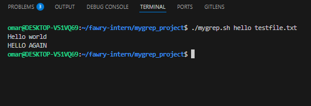
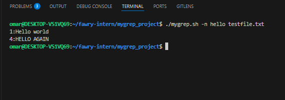
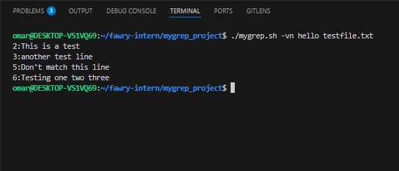
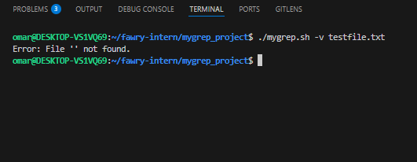

# mygrep-script

## Description
A mini version of the `grep` command written in Bash to search for strings in a text file with support for options like `-n` (show line numbers) and `-v` (invert match).

## Features
- Search for a string (case-insensitive)
- Print matching lines from a text file
- Show line numbers with `-n`
- Invert match with `-v`

## Installation
To get started with `mygrep.sh`, follow these steps:

1. **Clone the repository**:
   ```bash
   git clone https://github.com/omas2584/mygrep-script.git

2. Make the script executable:
chmod +x mygrep.sh

3. Run the script: Execute the script as follows:
./mygrep.sh [OPTIONS] [SEARCH_STRING] [FILE]


## Usage Examples

Below are the required test cases:

### 1. Run `./mygrep.sh hello testfile.txt`


### 2. Run `./mygrep.sh -n hello testfile.txt`


### 3. Run `./mygrep.sh -vn hello testfile.txt`


### 4. Run `./mygrep.sh -v testfile.txt` (should warn about missing search string)


## Reflective Section

1. Breakdown of Script Handling Arguments and Options
The script uses basic argument parsing to handle different options:

The search string is required, and the script checks if it's provided.

The -n option adds line numbers to the output.

The -v option inverts the match (shows lines that do not match).

The options are handled by checking for the presence of flags using a simple if condition.

The logic then processes the text file, matching the provided string and applying the appropriate options as needed.

2. Supporting Regex or Additional Options
If I were to support regex or options like -i (ignore case), -c (count matches), or -l (list filenames matching the pattern):

For regex support, I would modify the script to utilize grep's built-in regex engine.

For -i, I would add a conditional to enable case-insensitive matching.

For -c, I would implement counting the number of matches and print that count.

For -l, I would return the filenames that contain a match rather than displaying the matching lines

3. Hardest Part to Implement
The hardest part of the script was handling the combination of options (like -vn or -nv) and ensuring that the output is formatted properly, as well as dealing with invalid input (e.g., missing search string). This required careful handling of conditions to make sure the script would display meaningful errors and behave correctly when multiple options were used.